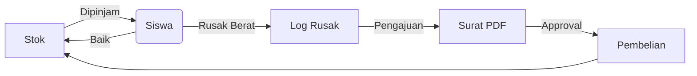
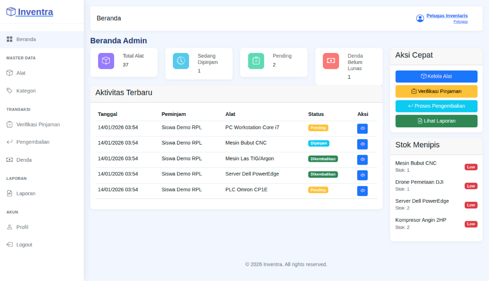
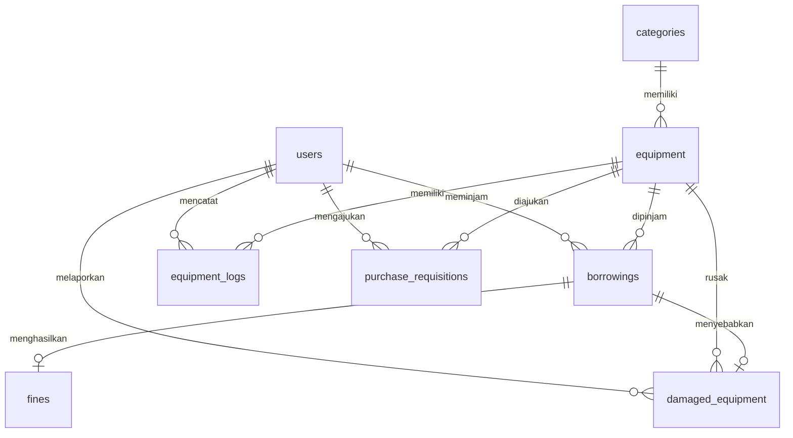

# Inventra - Sistem Informasi Inventaris Sekolah


Aplikasi web untuk mengelola inventaris alat dan peminjaman di lingkungan sekolah kejuruan.

## Fitur Utama

| Modul | Deskripsi |
|-------|-----------|
| **Manajemen Inventaris** | CRUD alat dengan kode unik, stok, kondisi, foto. 9 kategori jurusan (RPL, TKJ, DPIB, dll) |
| **Peminjaman** | Request → Approval → Tracking → Pengembalian. Cek stok otomatis |
| **Pengembalian** | Input kondisi barang (Baik/Rusak Ringan/Rusak Berat). Denda keterlambatan Rp 5.000/hari |
| **Barang Rusak** | Log kerusakan detail. Barang rusak berat tidak kembali ke stok |
| **Pengajuan Pembelian** | Workflow approval + cetak surat resmi PDF dengan kop sekolah |
| **Laporan** | Statistik dashboard, laporan per periode, export PDF |

### Role & Akses

| Role | Hak Akses |
|------|-----------|
| Admin | Full access, approval semua transaksi, user management |
| Petugas | Operasional harian, verifikasi, proses pengembalian |
| Peminjam | Browse katalog, request peminjaman |

## Alur Sirkulasi Aset



## Tech Stack

| Layer | Teknologi |
|-------|-----------|
| Backend | Laravel 11, PHP 8.2+ |
| Frontend | Bootstrap 5 (Mazer Admin Template) |
| Database | MySQL 8.0+ |
| Auth | Laravel Breeze |
| PDF | DomPDF |

## Requirements

- PHP 8.2+ dengan ekstensi: `gd`, `mbstring`, `openssl`, `pdo_mysql`, `zip`
- Composer 2.x
- Node.js 18+ & npm
- MySQL 8.0+

## Instalasi

```bash
# Clone
git clone https://github.com/trixxsobased/inventra.git
cd inventra

# Dependencies
composer install
npm install && npm run build

# Environment
cp .env.example .env
php artisan key:generate

# Database (edit .env dulu)
php artisan migrate --seed

# Run
php artisan serve
```

Akses: `http://localhost:8000`

## Default Credentials

| Role | Username | Password |
|------|----------|----------|
| Admin | `admin` | `admin123` |
| Petugas | `petugas` | `petugas123` |
| Peminjam | `siswa` | `siswa123` |

> Login bisa menggunakan username atau email (contoh: `admin@smkn1jenangan.sch.id`)

## Screenshots

| Dashboard Admin | Dashboard Petugas | Dashboard Peminjam |
|-----------------|-------------------|--------------------|
|  |  |  |

## Database Schema



**Tabel Utama:**
- `users` - Admin, Petugas, Peminjam
- `categories` - 9 kategori jurusan
- `equipment` - Data inventaris
- `borrowings` - Transaksi peminjaman
- `fines` - Denda keterlambatan
- `equipment_logs` - Riwayat perubahan stok

**Tabel Pendukung:**
- `damaged_equipment` - Log barang rusak berat
- `purchase_requisitions` - Pengajuan pembelian

## Fitur Teknis

- Database trigger untuk auto-update stok
- Soft delete untuk data historis
- Upload gambar dengan validasi
- Responsive design (mobile-friendly)
- Session-based authentication

## Developer

**Nama:** trixxsobased  
**Kelas:** XII RPL C  
**Tahun Ajaran:** 2025/2026  
**Institusi:** SMK Negeri 1 Jenangan  

---

**Project Uji Kompetensi Keahlian (UKK)** - Paket 1: Sistem Inventaris

## License

MIT License - Lihat file [LICENSE](LICENSE) untuk detail.