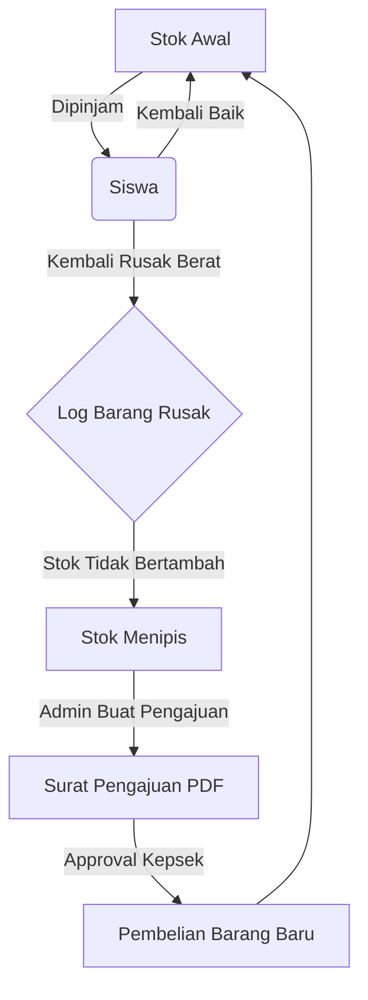
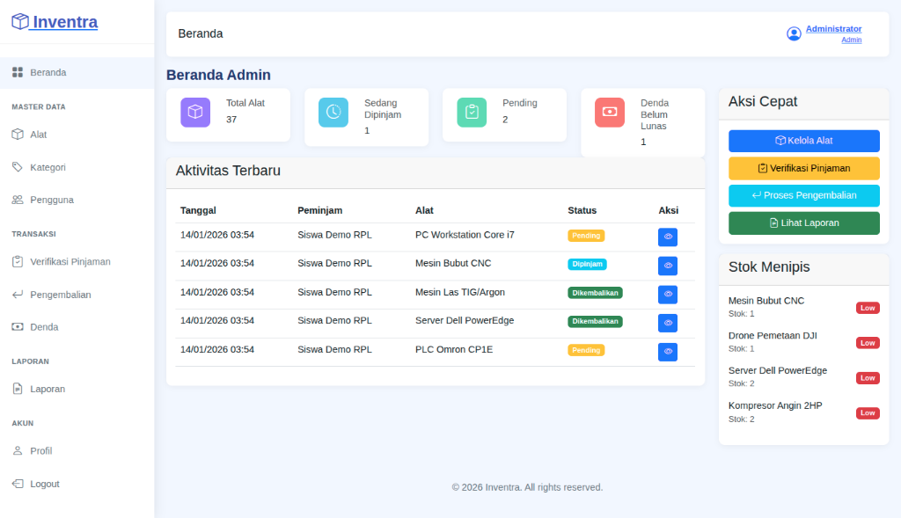
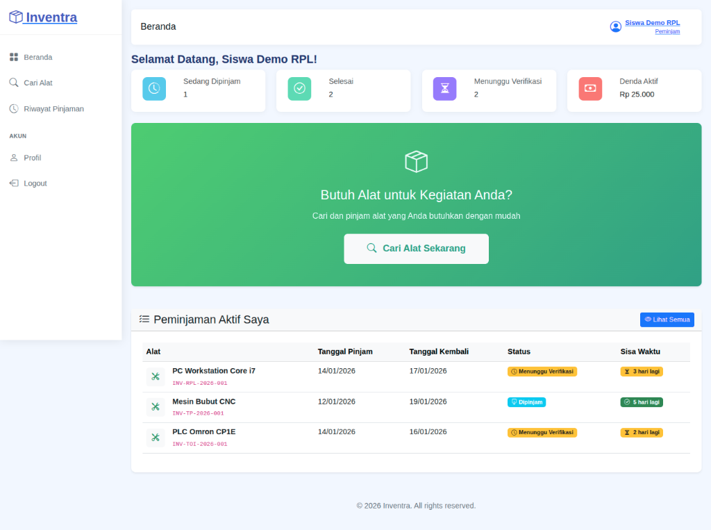

# Inventra - Sistem Informasi Inventaris Sekolah


Aplikasi web untuk mengelola inventaris alat dan peminjaman di SMK Negeri 1 Jenangan.

## Fitur Utama

**Manajemen Inventaris**
- CRUD alat dengan kode unik, kategori, stok, kondisi
- 9 kategori jurusan: RPL, DPIB, TKP, TOI, TPM, TLAS, TBSM, TEI, TPTU
- Upload foto alat
- Tracking kondisi: Baik, Rusak Ringan, Rusak Berat, Maintenance

**Sistem Peminjaman**
- Request peminjaman oleh siswa
- Approval/reject oleh admin/petugas
- Cek ketersediaan stok otomatis
- Status tracking lengkap

**Pengembalian & Kondisi Barang**
- Input kondisi saat dikembalikan (Baik/Rusak Ringan/Rusak Berat)
- Barang rusak berat tidak menambah stok kembali
- Log kerusakan dengan deskripsi detail
- Kalkulasi denda otomatis untuk keterlambatan (Rp 5.000/hari)

**Pengajuan Pembelian**
- Buat pengajuan untuk barang baru atau pengganti barang rusak
- Approval workflow dengan review notes
- Cetak surat pengajuan resmi (PDF) dengan kop sekolah
- Estimasi harga dan prioritas pengajuan

**Laporan**
- Laporan peminjaman per periode
- Dashboard dengan statistik
- Export PDF

**Multi Role**
- Admin: Full access, approval, user management
- Petugas: Operational, verifikasi, pengembalian
- Peminjam (Siswa): Browse catalog, request borrow

## Alur Sirkulasi Aset



## Tech Stack

- Laravel 11
- MySQL
- Bootstrap 5 (Mazer template)
- Laravel Breeze (authentication)
- DomPDF (generate surat resmi)
- PHP 8.2+

## Instalasi

1. Clone repo
```bash
git clone https://github.com/trixxsobased/inventra.git
cd inventra
```

2. Install dependencies
```bash
composer install
npm install && npm run build
```

3. Setup environment
```bash
cp .env.example .env
php artisan key:generate
```

4. Konfigurasi database di `.env`
```
DB_DATABASE=inventra
DB_USERNAME=root
DB_PASSWORD=
```

5. Migrate & seed
```bash
php artisan migrate --seed
```

6. Run server
```bash
php artisan serve
```

Buka `http://localhost:8000`

## Default Login

| Role | Username | Password |
|------|----------|----------|
| Admin | `admin` | `admin123` |
| Petugas | `petugas` | `petugas123` |
| Peminjam | `siswa` | `siswa123` |

> Login bisa pakai Username atau Email (`admin@smkn1jenangan.sch.id`)

## Screenshot

### Dashboard Admin


### Dashboard Peminjam


## Database Schema

**Tabel Utama:**
- `users` - Data user (admin/petugas/peminjam)
- `categories` - Kategori alat per jurusan
- `equipment` - Data inventaris alat
- `borrowings` - Transaksi peminjaman
- `fines` - Denda keterlambatan
- `equipment_logs` - History perubahan stok

**Tabel Tambahan:**
- `damaged_equipment` - Log barang rusak berat
- `purchase_requisitions` - Pengajuan pembelian barang

## Fitur Tambahan

- Auto update stok via database trigger
- Tracking kondisi barang saat pengembalian
- Sistem pengajuan pembelian dengan approval
- Generate surat pengajuan resmi (PDF)
- Responsive design
- Upload avatar user

## Developer

Dibuat sebagai project UKK RPL - SMK Negeri 1 Jenangan